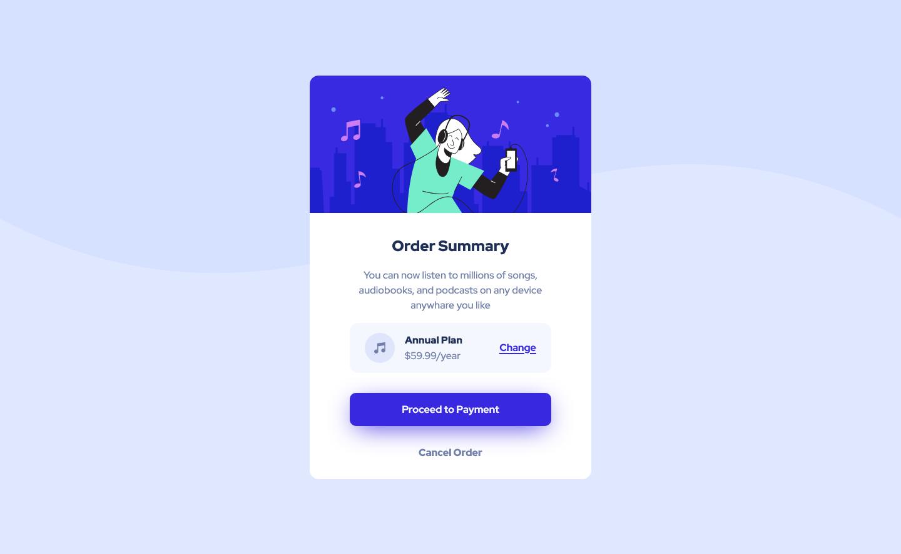

# Frontend Mentor - Order summary card solution

This is a solution to the [Order summary card challenge on Frontend Mentor](https://www.frontendmentor.io/challenges/order-summary-component-QlPmajDUj). Frontend Mentor challenges help you improve your coding skills by building realistic projects. 

## Table of contents

- [Overview](#overview)
  - [The challenge](#the-challenge)
  - [Screenshot](#screenshot)
  - [Links](#links)
  - [Built with](#built-with)
  - [What I learned](#what-i-learned)
  - [Continued development](#continued-development)
  - [Useful resources](#useful-resources)
- [Author](#author)

**Note: Delete this note and update the table of contents based on what sections you keep.**

## Overview

This is my first frontend mentor challenge and i picked it up cuz i dont know how to pick a desgin with svg 'i know it's funny', and it's not pixel perfect
### The challenge

Users should be able to:

- See hover states for interactive elements
- be responsive in until 1920*1080p 

### Screenshot

### Links

- Solution URL: [solution](https://zyadfallatah.github.io/frontend-mentor-challenge-1/)
- Live Site URL: [click here to see live site](https://zyadfallatah.github.io/frontend-mentor-challenge-1/)

### Built with

- Semantic HTML5 markup
- Flexbox
- uses em and rem
- user css variables

### What I learned

I recap some of CSS I use before

### Continued development

I want to focus more in:
- responsive css 
- using em and rem 
- use less media
- write a semantic html

### Useful resources

It's just a recap and i didn't need any resource to biuld it but i learn css from -[elzero](https://www.youtube.com/c/ElzeroInfo) about 1 month ago

## Author

- Website - [zyadfallatah](https://zyadfallatah.github.io/frontend-mentor-challenge-1/)
- Frontend Mentor - [@zyadfallatah](https://www.frontendmentor.io/profile/zyadfallatah)

